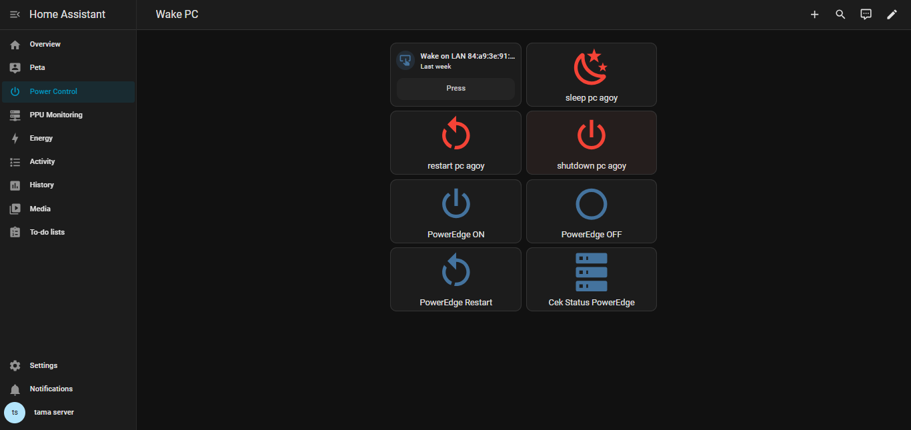
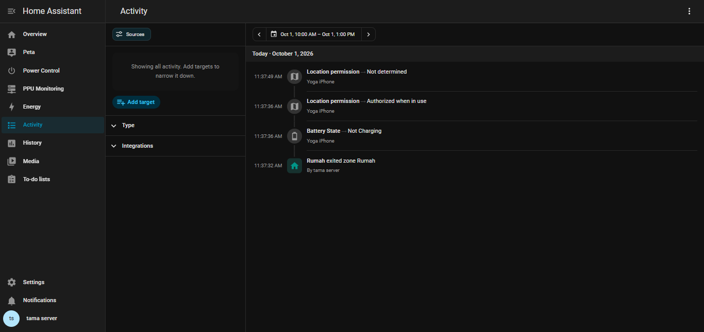
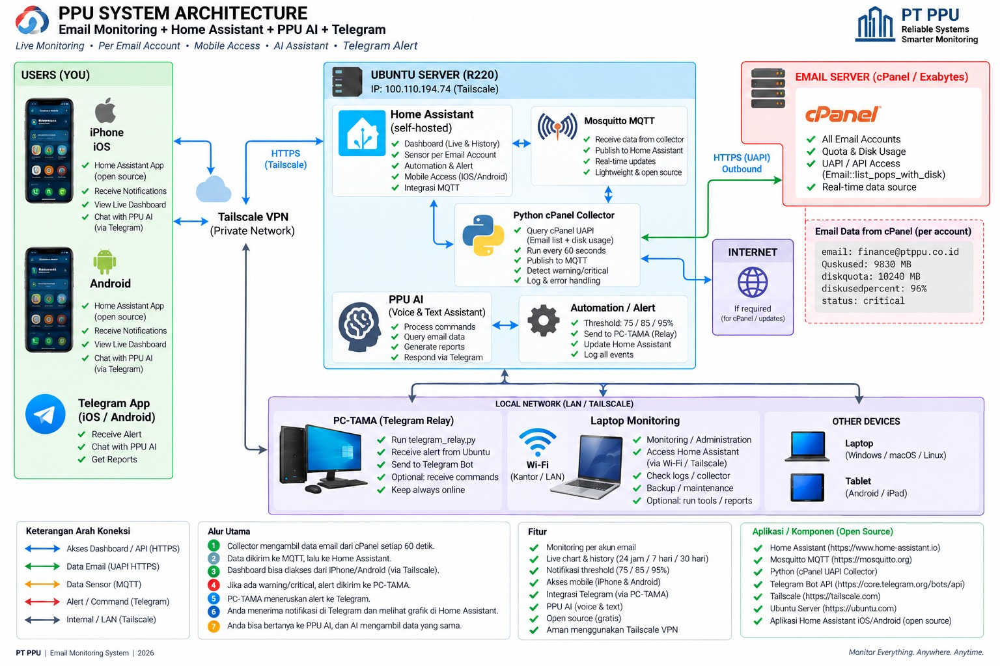
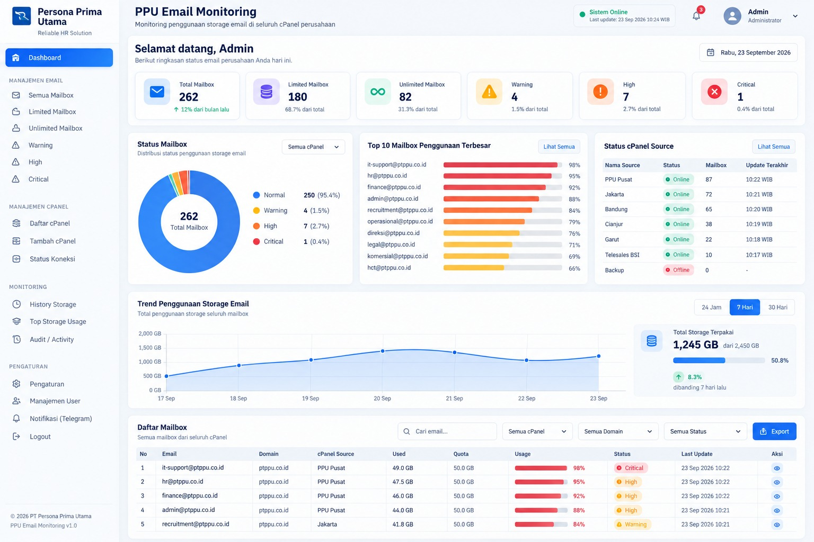
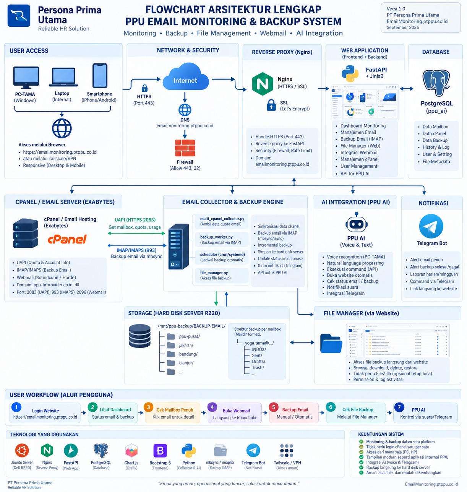

# PPU Email Monitoring & Infrastructure Automation

## Portfolio Project

A portfolio presentation of an internal IT infrastructure project involving **email storage monitoring, server monitoring, Telegram alerting, Home Assistant automation, remote access, and infrastructure architecture**.

> **Public portfolio note:** The screenshots in this repository are sanitized for public publication. Internal email identities, domains, IP addresses, URLs, and operational details have been removed or obscured.

## What I Worked On

### 1. Email Storage Monitoring
- Monitored mailbox storage usage and quota status.
- Integrated cPanel UAPI as the email data source.
- Built monitoring logic using Python on Ubuntu Server.
- Implemented usage thresholds such as normal, warning, high, and critical.
- Provided reporting and operational status through Telegram.

### 2. Telegram Monitoring Bot
The monitoring bot provides operational commands such as:
- `/fullreport`
- `/mailbox`
- `/top10`
- `/critical`
- `/status`
- `/cpanelstatus`
- `/backupfailed`
- `/delivery`
- `/errors`

The public screenshots show the monitoring concept while removing internal identities and data.

### 3. Home Assistant & Remote PC Control
Home Assistant was used as an automation interface for:
- Wake-on-LAN
- PC restart
- PC shutdown
- PC sleep
- Server power/status controls
- Remote dashboard access

### 4. Infrastructure Architecture
The project architecture connected multiple components including:
- Ubuntu Server
- Home Assistant
- Python services
- cPanel / email hosting
- Telegram Bot
- Tailscale private networking
- Monitoring dashboard
- API/backend services

## Technology Stack

`Python` · `Ubuntu Server` · `cPanel UAPI` · `Telegram Bot API` · `Home Assistant` · `Tailscale` · `Linux` · `FastAPI` · `Docker` · `PowerShell`

## Screenshots

### Home Assistant — Power Control

### Home Assistant — Activity

### Telegram Monitoring Bot

### Telegram Storage Report

### System Architecture

### Email Monitoring Dashboard

### Full Infrastructure Flowchart

## My Role

**IT Infrastructure & Network Support / System Monitoring**

Key responsibilities demonstrated by this portfolio:
- Infrastructure monitoring
- Network and remote-access troubleshooting
- Linux server administration
- Monitoring automation
- API integration
- Telegram alerting
- Home Assistant automation
- Documentation and system architecture

## Security

Do not publish production credentials, API tokens, passwords, VPN keys, private IP information, mailbox identities, or confidential company data.

This portfolio package intentionally contains sanitized screenshots for public GitHub use.
