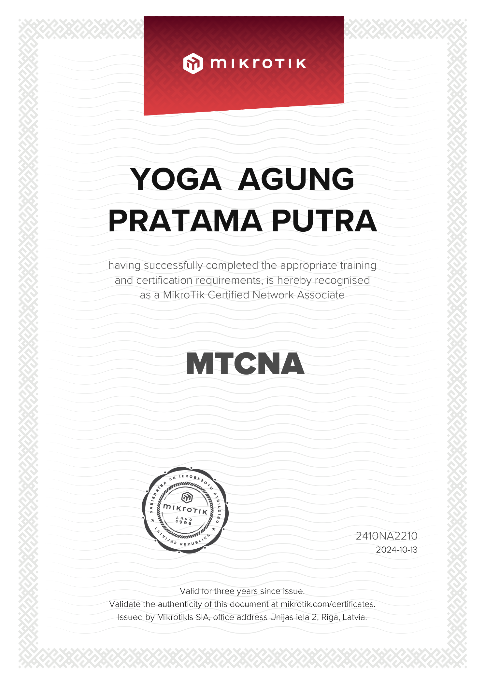

# Certification

## MTCNA — MikroTik Certified Network Associate

**Holder:** Yoga Agung Pratama Putra  
**Certificate ID:** 2410NA2210  
**Issue Date:** 13 October 2024  
**Validity:** Three years from issue  

### Certificate Preview

### Original Certificate

[Open original PDF certificate](./MTCNA-Yoga-Agung-Pratama-Putra.pdf)

The certificate states that it was issued by MikroTikls SIA, Riga, Latvia, and provides the official MikroTik certificate validation address.
